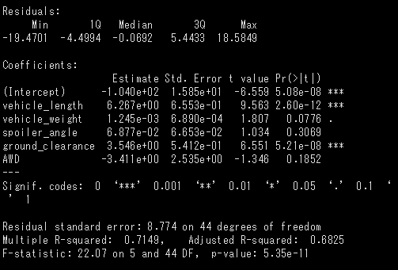
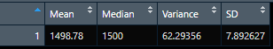
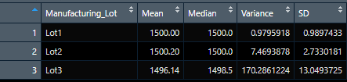
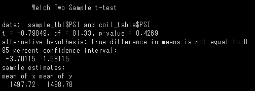
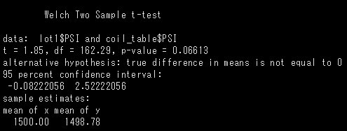
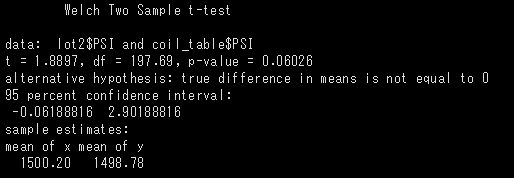
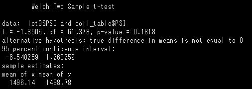

# MechaCar_Statistical_Analysis

## Linear Regression to Predict MPG
### MechaCar MPG Summary Statistics

- The variables/coefficients that provided a non-random amount of variance to the mpg values in the dataset were: **vehicle length**, **ground clearance**, and **intercept**.
- The slope of the model is not considered to be zero, as the p-value (5.35e-11) is sufficiently small to fail to reject the null hypothesis.
- This linear model effectively predicts mpg of MechaCar prototypes for this particullar dataset (r-sqaured=0.715), however this may be a case of overfitting as only 3 of the 6 coefficients were statistically significant.

## Summary Statistics on Suspension Coils

### Overall Suspension Coil Statistics

### Suspension Coil Statistics by Manufacturing Lot

When looking at the overall suspension coil statistics, it appears that the variance (~62.3) falls just under the maximum allowed variance of 100 lbs per square inch. 

However, if broken down by manufacturing lot it becomes clear that Lots 1 & 2 are well under the maximum allowed variance- whereas Lot 3 was well *above* the allowed variance, skewing the overall data. Lot 3 in particular fails to meet manufacturing specifications as it has a very high variance and standard deviation.

## T-Tests on Suspension Coils
### Summary
For all performed T-Tests(sample vs pop, lot1 vs pop, lot2 vs pop, lot3 vs pop) the p-value was above 0.05, indicating that there was no statistically significant difference between each sample group's mean and the population mean. 
 
### Sample vs Population

### Lot 1 T-Test Results

### Lot 2 T-Test Results

### Lot 3 T-Test Results
